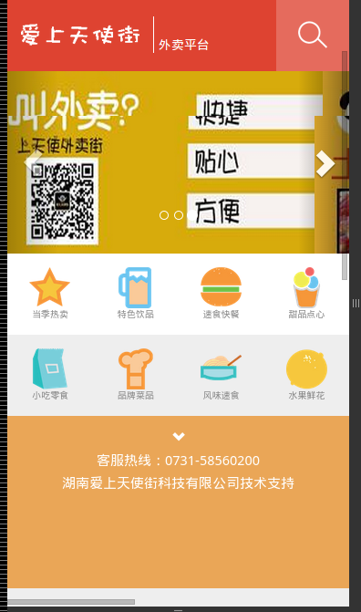
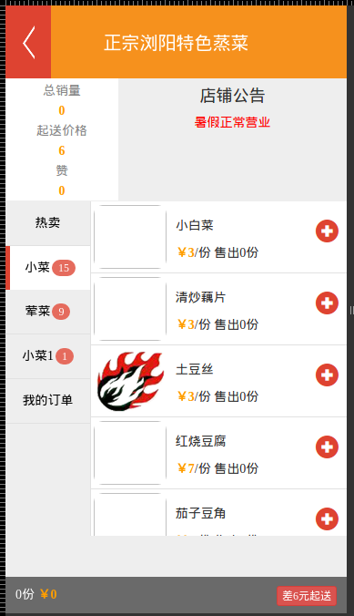
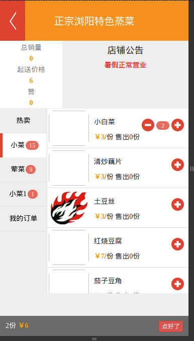
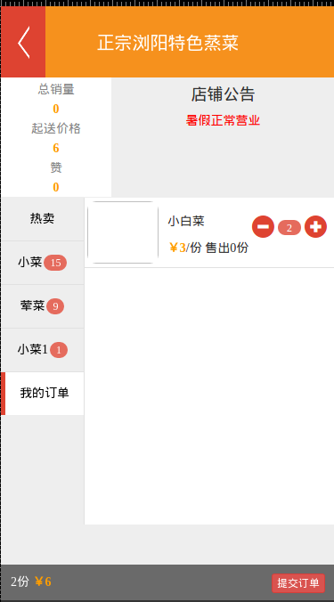
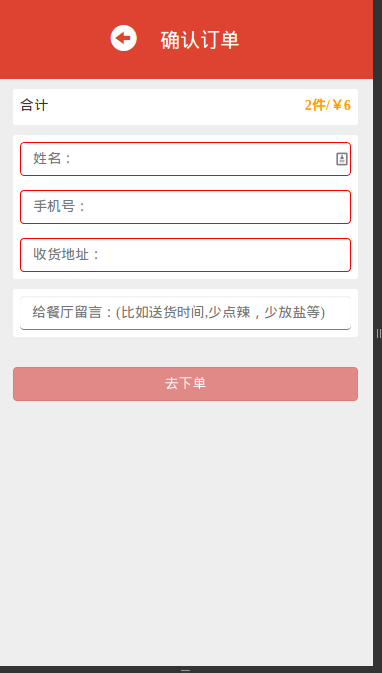
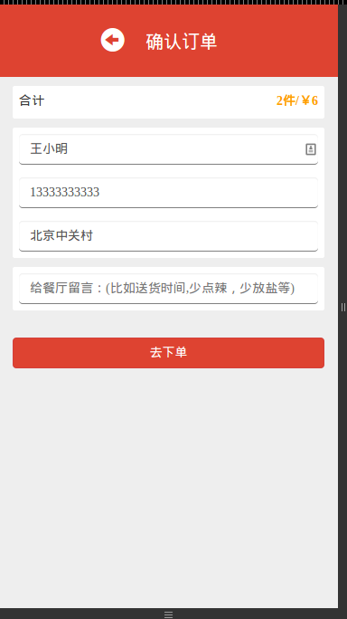

爱上天使街外卖平台
=======
这是模仿[美团外卖](http://i.waimai.meituan.com/home/wx4g0f69nfe7)的一个微信外卖平台。
开发者 [wangkechun](https://github.com/wangkechun) [JailBreakC](https://github.com/JailBreakC)

由于源代码含有较多敏感信息，所有在github只push了部分代码，并且没有保留版本历史记录。

此系统开发于2014年7、8月，上线于8月，然后9月就遇到饿了么、美团外卖补贴比拼之战。

然后产品惨遭遗弃，两个开发者已经跑去刷外卖单去了⊙﹏⊙‖∣(首单每单补贴4-16元，利用验证码接码平台、亲心小号、手机密号等方式可以无限首单)

##业务流程&功能简介
首先用户关注微信公众号，通过微信自定义菜单的按钮进入外卖平台下单，
然后商家会收到短信提醒or微信通知or打印好的订单，商家确认订单之后，用户会接到微信提醒:订单已经确认。
配送人员也会得到提醒。最后商家通知配送人员送货。配送成功之后用户可以在微信内直接回复评价.

##技术提要:
- 系统后端采用Python的Flask框架,数据库采用MongoDB,使用MongoEngine作为ORM引擎
- 前端采用AngularJS框架,Underscore工具库,Bootstrap界面库,触屏优化使用了iScroll
- 系统部署于bae3.0上(没钱用阿里云)
- JavaScript采用CoffeeScript编写，CSS使用Less编写，用Glup|Koala完成自动编译,js合并压缩
- 使用微信客服接口推送订单状态信息
- 使用七牛云存储来处理上传的商品图片自动裁剪压缩
- 使用[微米](http://www.weimi.cc/) 实现订单短信推送
- 使用win32print和win32con模块实现了自动使用热敏打印机打印订单

  > 这方面有成熟的方案 [飞印- 微信打印机](http://www.feyin.net/)，
  > 但是出于成本考虑我们购买了普通的热敏打印机,然后自己编写打印模块。
  > 打印客户端运行在本地电脑上,通过http轮询的方式实现实时打印订单(图方便)。

#####小票效果浏览（模板源代码）:
```
爱上天使街外卖平台外卖小票
=============================
销售单号:{{pid}}(顾客联)
流水号:{{_id['$oid']}}
顾客名称:{{name}}({{weixinname}})
联系电话:{{tel}}
留言:{{msg}}
店铺名称:{{info.name}}
店铺电话:{{info.tel}}
配送地址:{{addr}}
------------------------------
商品详情:
{{i.text}}

=============================
总件数:{{allcount}}件
总价:{{allprice}}元
销售时间:{{time}}
客服电话:13333333333

```

#####短信or微信提醒效果（模板源代码）:
```
你有新订单:
姓名:{{name}}
留言:{{msg}}
总件数:{{allcount}}
总价:{{allprice}}

店铺名称:{{info.name}}
店铺电话:{{info.tel}}

商品详情:
{{i.name}}\t{{i.price}}*{{i.count}}={{i.price*i.count}}

处理详情:
{{i.name}}{{i}}

请回复o{{pid}}确认订单
商品准备完毕之后，请回复p{{pid}}或者直接拨打我们的电话，我们的快递人员将马上和你联系。
```

##前端页面截图

  







